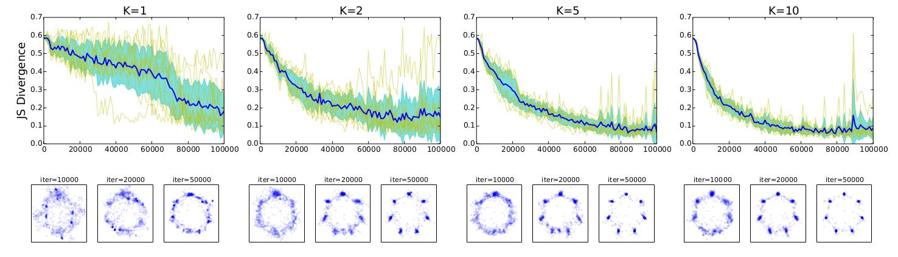
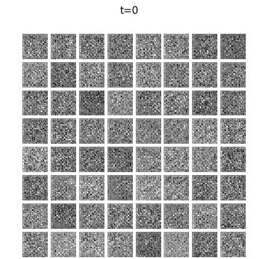
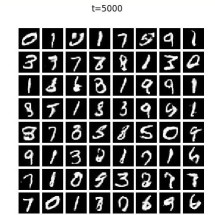

## K-Beam Minimax Optimization
#### For faster and more stable training of GANs and other adversarial optimization problems such domain adaptation, privacy preservation, and robust learning. 
---



### Abstract

Minimax optimization plays a key role in adversarial training of machine learning algorithms, such as learning generative models, domain adaptation, privacy preservation, and robust learning. 
In this paper, we demonstrate the failure of alternating gradient descent in minimax optimization problems due to the discontinuity of solutions of the inner maximization. 
To address this, we propose a new epsilon-subgradient descent algorithm that addresses this problem by simultaneously tracking K candidate solutions. 
Practically, the algorithm can find solutions that previous saddle-point algorithms cannot find, with only a sublinear increase of complexity in K.
We analyze the conditions under which the algorithm converges to the true solution in detail. 
A significant improvement in stability and convergence speed of the algorithm is observed in simple representative problems, GAN training, and domain-adaptation problems.

### Requirements
---
Python 2, Scipy, Tensorflow, Keras,

The MNIST-M dataset was created using the scripts from 
https://github.com/pumpikano/tf-dann
.


https://github.com/pumpikano/tf-dann/blob/master/utils.py


### Examples
---
#### 1. Run [test_minimax_simple.py](test_minimax_simple.py)
This script demonstrates the use of the k-beam minimax (and a few other optimization algorithms) in pure python.
The simple 2D surfaces are defined in the minimax_examples.py file.
If you run this script, you will get ....

```
Example 0/6
trial 0/100, test error: 0.000 (GD), 0.000 (Alt-GD), 0.000 (minimax K=1), 0.000 (minimax K=2), 0.000 (minimax K=5), 0.000 (minimax K=10)
trial 1/100, test error: 0.000 (GD), 0.000 (Alt-GD), 0.000 (minimax K=1), 0.000 (minimax K=2), 0.000 (minimax K=5), 0.000 (minimax K=10)
trial 2/100, test error: 0.000 (GD), 0.000 (Alt-GD), 0.000 (minimax K=1), 0.000 (minimax K=2), 0.000 (minimax K=5), 0.000 (minimax K=10)
trial 3/100, test error: 0.000 (GD), 0.000 (Alt-GD), 0.000 (minimax K=1), 0.000 (minimax K=2), 0.000 (minimax K=5), 0.000 (minimax K=10)
trial 4/100, test error: 0.000 (GD), 0.000 (Alt-GD), 0.000 (minimax K=1), 0.000 (minimax K=2), 0.000 (minimax K=5), 0.000 (minimax K=10)
trial 5/100, test error: 0.000 (GD), 0.000 (Alt-GD), 0.000 (minimax K=1), 0.000 (minimax K=2), 0.000 (minimax K=5), 0.000 (minimax K=10)

......

0.000 \pm 0.000 & 0.000 \pm 0.000 & 0.000 \pm 0.000 & 0.000 \pm 0.000 & 0.000 \pm 0.000 & 0.000 \pm 0.000 & \
0.000 \pm 0.000 & 0.000 \pm 0.000 & 0.000 \pm 0.000 & 0.000 \pm 0.000 & 0.000 \pm 0.000 & 0.000 \pm 0.000 & \
0.235 \pm 0.127 & 0.220 \pm 0.119 & 0.208 \pm 0.113 & 0.016 \pm 0.060 & 0.002 \pm 0.001 & 0.002 \pm 0.001 & \
0.242 \pm 0.012 & 0.242 \pm 0.012 & 0.242 \pm 0.012 & 0.113 \pm 0.117 & 0.038 \pm 0.083 & 0.003 \pm 0.023 & \
0.500 \pm 0.000 & 0.500 \pm 0.000 & 0.500 \pm 0.000 & 0.301 \pm 0.244 & 0.046 \pm 0.143 & 0.006 \pm 0.050 & \
0.138 \pm 0.041 & 0.138 \pm 0.041 & 0.137 \pm 0.043 & 0.027 \pm 0.055 & 0.001 \pm 0.000 & 0.001 \pm 0.000 &

```


#### 2. Run [test_minimax_mog_long.py](test_minimax_mog_long.py) 

The task is to learn a filter of face image from the Genki dataset which allows accurate classification of 'smile' vs 'non-smile' but prevents accurate classification of 'male' vs 'female'. 

The script finds a minimax filter by alternating optimization. The filer is a two-layer sigmoid neural net and the classifiers are softmax classifiers. 

The script will run for a few minutes on a desktop. 
After 50 iterations, the filter will achieve ~88% accuracy in facial expression classification and ~66% accuracy in gender classification.
```
trial 0/10, step 1000: jsd=0.575550, f=-1.38655, id_max=0
trial 0/10, step 2000: jsd=0.602133, f=-1.37656, id_max=0
trial 0/10, step 3000: jsd=0.493302, f=-1.38702, id_max=1
trial 0/10, step 4000: jsd=0.519081, f=-1.38356, id_max=0
trial 0/10, step 5000: jsd=0.497433, f=-1.38747, id_max=0
......
```


Results will be save to a file named 'test_NN_genki.npz'


#### 3. Run [test_minimax_da_mnistm.py](test_minimax_da_mnistm.py) 

```
K=2, J=1
trial 0/10, step 0: test err src=0.8905, tar=0.9093
trial 0/10, step 100: test err src=0.0805, tar=0.5922
trial 0/10, step 200: test err src=0.0491, tar=0.6436
trial 0/10, step 300: test err src=0.0471, tar=0.5577
trial 0/10, step 400: test err src=0.0334, tar=0.4933
trial 0/10, step 500: test err src=0.0365, tar=0.5121
trial 0/10, step 600: test err src=0.0327, tar=0.4681
trial 0/10, step 700: test err src=0.0846, tar=0.5191
trial 0/10, step 800: test err src=0.1043, tar=0.6619
trial 0/10, step 900: test err src=0.0404, tar=0.4417
trial 0/10, step 1000: test err src=0.029, tar=0.4204
......
```

#### 4. Run [test_minimax_mnist.py](test_minimax_mnist.py) 

```
step 100: f=-0.0431621, id_max=0
step 200: f=-0.0840572, id_max=3
step 300: f=-0.249747, id_max=1
step 400: f=-0.31125, id_max=2
step 500: f=-0.181053, id_max=4
step 600: f=-0.26613, id_max=2
step 700: f=-0.312954, id_max=4
step 800: f=-0.348138, id_max=4
step 900: f=-0.352485, id_max=2
step 1000: f=-0.702013, id_max=1
......
```

  


### Reference
---
* [J. Hamm and Yung-Kyun Noh, "K-Beam Subgradient Descent for Minimax Optimization," 
 ICML, 2018]()
* [J. Hamm, "Mimimax Filter: Learning to Preserve Privacy from Inference Attacks," arXiv:1610.03577, 2016](http://arxiv.org/abs/1610.03577)


